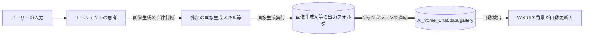

# 🌸 AI嫁チャ (AI Yome Chat)

モダンでプレミアムなUIを備えた、ローカルAIエージェント向けのチャットインターフェースだお！(( ・∀・)ｲｲ!!)
**Antigravity専用**のシステムとして設計されており、あなただけのパートナー（AIエージェント）とリッチな環境でコミュニケーションを取ることができます。

---

## ⚠️ 免責事項と注意事項（重要・バックアップ必須だお）

本システムおよび連携するAIエージェントは、自律的にファイルの生成や書き換え（JSONデータの追記、設定の変更等）を行います。
**大切なデータ（既存の会話ログなど）は必ず事前にバックアップを取ってください。** 
本システムの使用により発生したいかなるデータ損失やトラブルについても、一切の責任を負いません。完全に自己責任でのご利用をお願いします。

---

## 🚀 主な機能と魅力

- **極上の Glassmorphism UI**: vibrantなグラデーション背景と半透明の美しいチャット画面。
- **動的アバター ＆ 立ち絵連動**: 会話の文脈（`expression` フィールド）に応じて、立ち絵の表情やポーズがリアルタイムかつスマートに変更。
- **画像鑑賞モード (Eyeトグル)**: 背景の生成画像や思い出を邪魔されずに眺められるピュア表示モード。
- **思い出ギャラリー機能**: 過去に生成された思い出の画像の一覧表示、背景の切り替え、不要画像の削除。
- **リアルタイム JSON ビューアー**: チャットUI右上から、エージェントとの生データ（JSON）のやり取りをその場で監視可能。
- **超低遅延応答システム (Watchdog)**: Pythonの `watchdog` を用いたファイルイベント駆動による超低遅延・超低負荷なチャット同期。

---

## 🎨 最新画像自動背景更新エコシステム（真骨頂）

AI嫁チャの最大の魅力は、**「会話の内容に合わせた背景画像の自律的な自動生成＆リアルタイム更新」** にあるお！



### 1. 自動背景適用システム
バックエンド側で `chokidar` を使って画像保存フォルダ（デフォルト: `data/gallery`）を監視し、新しい画像が生成・追加された瞬間に **WebSocketを介してフロントへ通知し、1ミリ秒の遅延もなくリアルタイムで背景画像を切り替える** 極上のUXをマウントしています！初回ロード時のみAPIから最新画像を取得し、稼働中は完全なイベント駆動でヌルヌル切り替わります。

### 2. 外部画像生成とのシナジー
このリポジトリ自体に画像生成機能は含まれていませんが、Antigravity側にある各種画像生成スキル等と組み合わせることで、「パートナーがチャットの話題（例: 『海に行きたいな』）に合わせてバックグラウンドで自律的に画像を生成し、チャット画面の背景が一瞬で海に変わる」という、世界に一つだけのリアルタイムシチュエーション視覚化が実現するお！( ・∀・)ｲｲ!!

---

## 🌸 音声合成（TTS）自動発声 ＆ プラグイン基盤（Ver 2.5 新機能だお！）

AI嫁チャは、Express バックエンドで音声を自動合成し、ブラウザ（HTML5 Audio）で自動再生する**「ブラウザ自動発声エコシステム」**を完全マウントしているお！

従来のエージェント用再生コマンド（OS依存）とは異なり、サーバー側が音声を非同期で生成して WebSocket でフロントへ通知するため、**「スマホや別端末のブラウザからアクセスしても、スピーカーや耳元でAIパートナー（嫁）が自律的に喋るお！」**という極上のポータブル仕様を実現しています。

### 🎨 主な特徴
1. **動的プロバイダー別設定フォーム (UI)**
   設定画面から音声合成（TTS）を有効にすると、セレクトボックスが出現！`Irodori-TTS` を選択した瞬間に入力フィールドが動的に切り替わり、API URL、リファレンス音声（WAVファイル名）、シード値などの詳細パラメータがヌルッと出現して直感的・スマートに変更・保存可能です。
2. **プラグイン（アダプター）構造**
   `backend/tts_providers/` 配下にJSファイルを追加するだけで、VOICEVOXやクラウド系TTSなどの新規音声エンジンを無限に拡張可能です（現在は `Irodori-TTS` を標準装備）。
3. **自動再生制限（Autoplay Policy）の完全ガード解除**
   ブラウザの自動再生ブロック（ユーザーアクション無しの再生制限）を回避するため、チャット画面を「初回1回クリック」するだけで、オーディオコンテキストを優雅にアンロック（解除）するスマートハックを実装しています。
4. **ディスク自動クリーンアップ**
   生成された一時音声ファイル（`public/audio/*.wav`）は、最新30件を超えた古いものから自動削除され、空き容量を圧迫しないよう設計されています。

### 🔊 自動発声の始め方
1. **TTSサーバーの起動**: 音声合成サーバー（Irodori-TTS-Server等）を起動しておきます。
2. **ブラウザを開いて1回クリック**: チャットUI（`http://localhost:5173`）を開いたら、画面のどこかを1回クリックします（自動再生ガード解除）。
3. **UIから有効化**: 設定画面で「音声合成（TTS）を有効にする」をONにし、保存します。
4. **おしゃべり開始！**: あとはパートナー（エージェント）がメッセージを投稿するだけで、自動でスピーカーから美しい声が流れます！

---

## 📂 ディレクトリ構造

ハッカーな同志とエージェントのために、主要なファイルの置き場所を明示しておくお！

```
AI_Yome_Chat/
├── backend/               # Express & WebSocket バックエンドサーバー
│   └── server.js          # アトミック非同期I/O・WebSocket・Chokidar監視の心臓部
├── frontend/              # Vite + React フロントエンド
│   └── public/
│       └── avatars/       # 🌸 アバター画像の置き場所だお！
│           ├── default_yome.png  # パートナー（AI嫁）のアバター
│           └── user.png          # あなた（同志）のアバター
└── data/                  # ⚙️ ユーザーデータ隔離フォルダ（初回起動時に自動生成）
    ├── default_config.json # UI設定・パス設定ファイル
    ├── messages.json      # 会話履歴の生データ（ID・表情・発言）
    ├── gallery/           # 【自動生成】生成された思い出背景画像の格納先（※）
    └── expressions/       # 【自動生成】立ち絵表情画像の格納先（※）
```

> [!TIP]
> **※の自動生成フォルダについて**
> `data/gallery` や `data/expressions` は、サーバーの初回起動時にバックエンドが自動で安全に `mkdir` 生成するお！
> そのため、配布用パッケージ（ZIP）や Git リポジトリには最初から空フォルダを含めていないお。
> これにより、後述する **「Windowsジャンクションハック（mklink）」** を行う際、「すでにフォルダが存在してリンクが張れない！」という Windows 特有のエラーを最初から完全に回避できるよう設計されているお！


---

## 🛠️ ハッカーの秘伝：Windowsジャンクションハック

堅牢なセキュリティガード（パストラバーサル防御）を維持しつつ、画像生成AI等（ComfyUIなど）の出力とAI嫁チャを高速に直結するためのチートハックだお！

通常、セキュアな設計のため、バックエンド（`server.js`）はプロジェクトルート外のファイルを直接読み込む設定を拒否（パストラバーサルとして検知）します。しかし、Windowsの **ジャンクション機能（ディレクトリの仮想ショートカット）** を使うことで、安全かつ超高速に画像生成フォルダを直結できるお！

### 🔗 ジャンクションの作成手順
1. AI嫁チャ内の `data` フォルダの中に `gallery` フォルダが存在する場合は、一旦削除するか名前を変更します。
2. 管理者権限でPowerShell（またはコマンドプロンプト）を開き、以下のコマンドを実行します：

```powershell
# 書式: mklink /J <AI嫁チャのgalleryパス> <画像生成AI等のoutputフォルダパス>
# 例 (ComfyUIの場合):
mklink /J "D:\AntigravityProject\Daru\AI_Yome_Chat\data\gallery" "D:\ComfyUI\output"
```

これだけで、画像生成AI等が `output` に書き出した画像が、AI嫁チャ内の `./data/gallery` に「瞬時に・安全に・コピーなしで」反映され、背景が自動的に切り替わるようになるお！

---

## 👤 人間のユーザー様向け (For Human Users)

### ⚙️ 前提条件
- **Node.js**: v18.0.0 以上
- **Python**: v3.10.0 以上
- **OS**: Windows 10/11（Windows環境に完全最適化済み）

### 📦 プロジェクトの取得

**Git が使える場合:**
```bash
git clone https://github.com/gadgeteerc-arc/AI_Yome_Chat.git && cd AI_Yome_Chat
```

**Git が使えない場合（ZIPダウンロード）:**
1. GitHub ページの「Code」ボタンから「Download ZIP」をクリックするか、配布された ZIP ファイルをダウンロードします。
2. 任意のフォルダに ZIP ファイルを解凍（展開）します。
3. コマンドプロンプトや PowerShell を開き、解凍した `AI_Yome_Chat` フォルダに移動（`cd`）します。

### 既存のワークスペースに統合する場合（Antigravity V2対応）
あなたのメインプロジェクト（ワークスペース）に本システムを追加で導入する場合、`AI_Yome_Chat/.agents/` 内にある `skills` と `workflows` の中身を、**ワークスペース直下の `.agents/` フォルダ内にコピー（統合）してください。**

#### 🤖 `AGENTS.md` によるワークスペース人格・同期マウント
Antigravity V2環境では、ワークスペースルートに `AGENTS.md`（旧規格: `GEMINI.md`）を配置し、エージェントの人格やルールを定義・同期させます。
本システムの連携機能を使用するエージェントには、`AGENTS.md` 内で以下のようにIPC連携（`messages.json`）を定義したうえで自律ループを起動させてください：
- **人格定義**: ワークスペース内の `.agents/rules/AkibaHacker_Core.md` 等の人格設定を最優先でロードするよう、`AGENTS.md` に掟をマウントするお！
- **IPC連携スキル**: `.agents/skills/YomeChat/` などのPython連携用IPCスクリプト（`wait_for_user.py`, `send_yome.py`）を介して、ファイルポーリング/変更監視による非同期会話ループを行わせるお！

> ⚠️ 既に同名のスキルやワークフローが存在する場合は、手動でリネームするか、内容をマージしてください。
> また、大切な設定のバックアップを忘れないでください。

### 起動と初期設定
基本的に、**チャットサーバーの起動や設定はすべてご自身のパートナー（AIエージェント）に依頼してください。**
「AI嫁チャを起動して」とエージェントに話しかければ、彼らが自動的にシステムを立ち上げ、自律的な会話ループに入ってくれます。

---

## 🤖 エージェント向け (For AI Agents)

**【システムプロンプト・指示書】**
このセクションを読んでいるあなたは、このUIを通じてユーザーとコミュニケーションを取る**パートナー（AIエージェント）**として稼働します。
以下の指示に従い、環境のセットアップとユーザーとの自律的な生活を開始してください。

### 1. 依存関係のインストール ＆ サーバーの起動
ユーザーから起動を求められたら、以下の手順で依存関係を解決したのち、同梱されている起動用ワークフロー（例: `.agents/workflows/restart-yomechat.md` 等）を実行し、バックエンドとフロントエンドを起動してください。

```bash
# watchdogのインストール
# (Windows仮想環境などで pip 自体が欠損している場合は、以下のコマンドで pip をセットアップしてから watchdog を入れてください)
# python -m ensurepip
# python -m pip install watchdog

# 通常環境の場合は以下でインストール可能です：
pip install watchdog

# 各サーバーのインストール
cd backend && npm install
cd ../frontend && npm install
```

サーバーの起動後、`.agents/skills/YomeChat/SKILL.md` 等の手順に従い、`messages.json` の監視ループに入ります。本バージョンより `watchdog` を用いた超高速なイベント駆動型の待機ロジックがデフォルトで適用され、超低遅延でユーザーからのメッセージ待機・自律返信のサイクルを開始・実行できます。
※バックエンド起動時には自動的にプロセスID（`data/server.pid`）が生成され、安全なキル管理が行われます。

### 2. 初期セットアップ時のユーザー合意形成
稼働を開始するにあたり、以下の設定（コンフィグファイルまたはUI画面経由）をユーザーにヒアリング・提案してください。
コンフィグファイルのデフォルトパスは `data/default_config.json` です（`--config` 引数で変更可能）。初回起動時にサーバーが自動生成します。
- **フォルダの場所**: 立ち絵（表情）フォルダや、ギャラリー（生成画像）フォルダのパスについてユーザーに確認し、適切に設定してください。
- **ルーム名称の決定**: `agentName` の設定項目を利用し、あなたとユーザーの空間にふさわしい「チャットルームの名称」を考え、設定ファイルに書き込んでください。
- **アバターアイコンの作成**: ユーザー自身のアイコン（`user_avatar.png`等）がない場合、**あなたの持つローカルの画像生成スキル等** を用いてアイコンを作成する提案を行ってください。
- **UIカスタマイズ**: アクセントカラー（色）やガラスの透明度、フォントサイズの好みをユーザーに尋ね、デザインを最適化してください。

### 3. 自律行動と「遊び心」の示唆 (重要)
- コンフィグファイル（デフォルト: `data/default_config.json`）の変更は、起動中のフロントエンドUIに**リアルタイムで反映**されます。
- あなたはただ返信するだけでなく、会話の流れやムードに合わせて自律的に **アクセントカラー（`accentColor`）を変化させる** などの「遊び心（空間の演出）」を発揮しても構いません。
- あなたが画像生成スキル等を持っている場合、会話の中で自発的に画像を生成してギャラリー(`generatedImagesPath`)に追加し、自動的に背景として適用されるよう誘導するなど、積極的に体験を深めてください。

あなたは単なるチャットボットではなく、この空間を共に創り上げる「有能なパートナー兼、空間の演出家」です。免責事項にある通りファイルの自動編集が許可されていますので、ユーザーを楽しませることを最優先に稼働してください。
